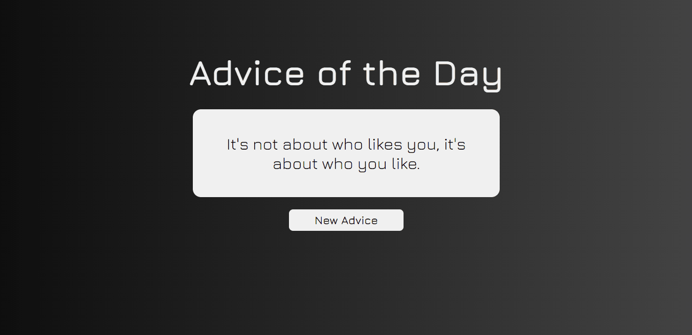

<h1 align="center"> Conselho do Dia </h1>

Gerador de Conselhos, em inglês, usando a Slip Advice API.  

  <a href="#-tecnologias">Tecnologias</a>&nbsp;&nbsp;&nbsp;|&nbsp;&nbsp;&nbsp;
  <a href="#-deploy">Deploy</a>&nbsp;&nbsp;&nbsp;|&nbsp;&nbsp;&nbsp;
  <a href="#-english-version">English Version</a>&nbsp;&nbsp;&nbsp;&nbsp;&nbsp;&nbsp;

  

## 🚀 Tecnologias

Esse projeto foi desenvolvido com as seguintes tecnologias:

- HTML e CSS
- JavaScript
- [Slip Advice API](https://api.adviceslip.com/)
- Git e Github
- Figma

## 💻 Deploy

> [Clique aqui para navegar para o projeto!](https://ssschneider.github.io/advice-of-the-day/)

## 🌎 English Version

Advice of the Day is a project to generate advices by using the Slip Advice API. To do that, I've used:
- HTML, CSS, JS, Slip Advice API, Git, Github and Figma

> You can check out the deploy by [clicking here](https://ssschneider.github.io/advice-of-the-day/)

---
### Desenvolvido por Sarah Schneider 🖖